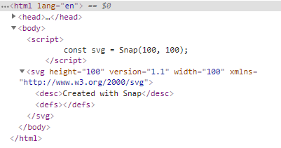

### Snap.svg.js

SVG 是创建交互式、分辨率独立的矢量图形的极好方法，在任何大小的屏幕上都会很好看。而且Snap.svg.js 库使处理 svg 变得和 jQuery 处理 DOM 一样简单。

- 官方网站： http://snapsvg.io/ 
- 中文翻译网站： https://www.zhangxinxu.com/GitHub/demo-Snap.svg/demo/basic/ 

### 创建 SVG

> md，文学功底真差，名字都不会起

#### 创建 SVG 标签

可以直接使用 Snap 在一个空的 html 文件中创建 SVG

```html
<!DOCTYPE html>
<html lang="en">
<head>
    <meta charset="UTF-8">
    <title>Snap</title>
    <script src="snap.svg.js"></script>
</head>
<body>
    
    <script>
        const svg = Snap(100, 100)
    </script>
</body>
</html>
```

查看源代码，发现这句代码竟然留下了自己的足迹：



#### 包裹 SVG 标签

页面中存在一个 svg 标签，也可以使用 Snap 进行封装：

```html
<!DOCTYPE html>
<html lang="en">
<head>
    <meta charset="UTF-8">
    <title>Snap</title>
    <script src="snap.svg.js"></script>
</head>
<body>
    <svg height="100" width="100" xmlns="http://www.w3.org/2000/svg"></svg>
    <script>
        const svg = Snap("svg")
        console.log(svg) 
    </script>
</body>
</html>
```

查看控制台，发现 Snap 将 svg 包装成一个 Element，svg dom 元素作为其的 node

```
Element {node: svg, type: "svg", id: "svgSk3ssiq6b0", anims: {…}, _: {…}, …}
```

#### 加载外部 SVG 文件

```javascript
Snap.load('svg/lk.svg', function (svg) {
    // do something with svg
})
```

由于跨域问题，加载外部文件需要在服务器环境中。

### 绘制图形

一下绘制一个圆形，设置边框红色、宽度 2、填充绿色。

```javascript
const svg = Snap("svg")
svg.paper.circle(50, 50, 30).attr({
    stroke: "red",
    strokeWidth: 2,
    fill: "green"
})
```

<svg height="100" width="100"><circle cx="50" cy="50" r="30" stroke="#ff0000" style="stroke-width: 2;" fill="#008000"></circle></svg>
绘制其他图形(椭圆、图片、矩形、路径等等)也就大同小异了，参见官网 API 即可

### Snap 动画

使用 Snap 做动画有两种实现方式，一种是每个元素的 animate() 方法，另一种是 Snap.animate() 方式。

#### Element.animate()

Element.animate(attrs, duration, [easing], [callback])

- attrs：要改变的元素属性
- duration：动画的持续时间
- easing：缓动函数，即动画的变换效果
- callback：动画执行结束的回调函数

以下代码表示：点击圆形，在 1s 内颜色变为蓝色

```javascript
const svg = Snap("svg")
const circle = svg.paper.circle(50, 50, 30).attr({
    fill: "green"
})
circle.node.addEventListener("click", function(){
    circle.animate({
        fill: "blue"
    }, 1000, mina.bounce, function(){
        console.log("动画结束")
    })
})
```

<iframe src="https://augustuzzl.github.io/code/svg/1.html"></iframe>

#### Snap.animate()

const mina = Snap.animate(from, to, setter, duration, [easing], [callback])

- from：动画的起始数值或数组
- to：动画的结束数值或数组
- setter：能够接收到动画执行过程中的数值
- duration：动画持续时间
- easing：动画变换的效果
- callback：动画执行结束的回调函数
- mina：返回值，代表这个动画对象

以下代码表示：点击圆形，半径变大

```javascript
const svg = Snap("svg")
const circle = svg.paper.circle(50, 50, 30).attr({
    stroke: "red",
    strokeWidth: 2,
    fill: "green"
})
circle.node.addEventListener("click", function(){
    const mina = Snap.animate(30, 50, function(val){
        circle.attr({
            r: val
        })
    }, 1000, mina.bounce, function(){
        console.log(mina)
    })
})
// 类似于：circle.animate({r: 50}, 1000, mina.bounce)
```

### Snap 变换

使用 Snap 做变换是每个元素的 transform() 方法，可以结合 Matrix() 矩阵使用

#### Matrix

Matrix 类有多个 api，例如：Matrix.rotate()、Matrix.scale() 等等

例如旋转变换：Matrix.rotate(a, x, y)

- a：旋转的角度
- x, y：旋转中心的坐标，为用户坐标系，即从 svg 左上角开始

```javascript
const svg = Snap("svg")
const rect = svg.paper.rect(20, 20, 60, 60).attr({
    fill: "red"
})
const m = new Snap.Matrix()
m.rotate(45, 50, 50)
rect.transform(m)
```

#### Element.transform()

直接使用 Element.transform(str)

- str 字符串，很简单，就是将变换写为字符串的形式

```javascript
const svg = Snap("svg")
const rect = svg.paper.rect(20, 20, 60, 60).attr({
    fill: "red"
})
rect.transform("rotate(45, 50, 50)")	
```

<svg id="svg" width="100" height="100"><rect x="20" y="20" width="60" height="60" fill="#ff0000" transform="matrix(0.7071,0.7071,-0.7071,0.7071,50,-20.7107)" style=""></rect></svg>

### Snap 变换动画

实现变换动画，就要将 Snap 动画和 Snap 变换结合起来了，这里体现出 Snap.animate() 的用处了:

点击图形，让其不断旋转：

```javascript
const svg = Snap("svg")
const rect = svg.paper.rect(20, 20, 60, 60).attr({
    fill: "red"
})
rect.node.addEventListener("click", function(){
    rotate()
})
function rotate(){
    Snap.animate(0, 90, function(val){
        const m = new Snap.Matrix()
        m.rotate(val, 50, 50)
        rect.transform(m)
        // rect.transform(`rotate(${val}, 50, 50)`)
    }, 2000, function(){
        // 动画结束后，继续执行
        rotate()
    })
}
```

<iframe src="https://augustuzzl.github.io/code/svg/2.html"></iframe>

### Snap 路径动画

路径 path 算是 svg 中最强的功能了，使用它可以绘制任意的图形，下面实现物体在路径上的运动

#### 曲线运动

如下：点击小球开始沿曲线(为了简便，使用直线，直线也是一种特殊的曲线)运动

```javascript
const svg = Snap("svg")
const path = svg.paper.path("M10 10L90 90").attr({
    fill: "none",
    stroke: "black",
    strokeWidth: 2
})
const circle = svg.paper.circle(10, 10, 10).attr({
    fill: "red"
})
circle.node.addEventListener("click", function(){
    Snap.animate(0, path.getTotalLength(), function(val){
        const movePoint = path.getPointAtLength(val)
        circle.attr({
            cx: movePoint.x,
            cy: movePoint.y
        })
    }, 2000)
})
```

- 相信看完代码也就明白了，path.getTotalLength() 获取路径的总长度，然后根据动画获取某个长度出的坐标，再将圆移动到这里


<iframe src="https://augustuzzl.github.io/code/svg/3.html"></iframe>


将单个图形沿曲线运动很方便，直接设置属性值就可以了，但对于组合图形，并没有这些属性，只能使用矩阵变换了。

下面我们使用 path 画一个图形来代替组合图形，实现他的曲线运动

```javascript
const svg = Snap("svg")
const path = svg.paper.path("M10 10L90 90L180 10").attr({
    fill: "none",
    stroke: "black",
    strokeWidth: 2
})
const person = svg.paper.path("M100 10 h20 L110 30Z").attr({
    fill: "red"
})
// 点击运动
person.node.addEventListener("click", function(){
    Snap.animate(0, path.getTotalLength(), function(val){
        const movePoint = path.getPointAtLength(val)
        const x = movePoint.x
        const y = movePoint.y
        const deg = movePoint.alpha
        const m = new Snap.Matrix()
        //利用Snap.deg()函数。把弧度值转换成角度值
        m.rotate(Snap.deg(deg / 180 * Math.PI), x, y)
        m.translate(x - 110, y - 30)
        person.transform(str)
    }, 2000)
})
```

- m.rotate()：让物体根据路径的切线不断变化角度
- m.translate()：让物体进行变换移动，**注意**此处是相对于物体自身的移动距离，所以要减去物体本身的坐标，

<iframe src="https://augustuzzl.github.io/code/svg/4.html"></iframe>